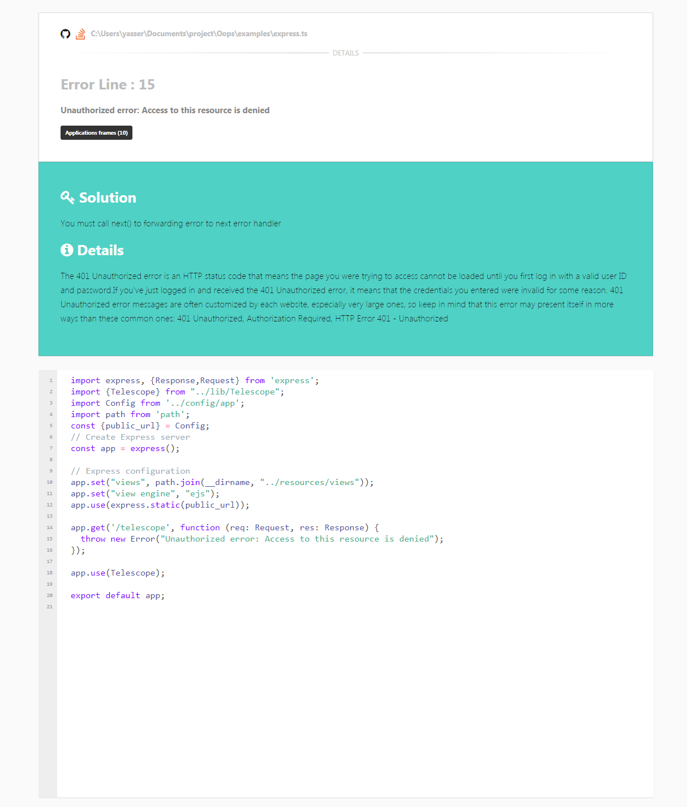

##  Telescope: A beautiful error page for Expressjs apps

[Telescope]() is a beautiful and customizable error page for expressjs applications for both development and production mode.
Feel free to check out the [changelog](/CHANGELOG.md), [security policy](.github/SECURITY.md), [license](LICENSE.md), [commit convention](.github/COMMIT_CONVENTION.md).

## Requirements
Telescope has a few requirements you should be aware of before installing:

- Node.js >= 8.0.0
- npm >= 6.10.3

## Installation

This is a Node.js module available through the npm registry.
Installation is done using the [npm install command](https://docs.npmjs.com/downloading-and-installing-packages-locally):
<pre>
 npm install express-telescope --save-dev
</pre>

## Browser Support

Telescope supports reasonably recent versions of the following browsers:

- Google Chrome
- Apple Safari
- Microsoft Edge

## Examples
To view the examples, clone the Express repo and install the dependencies:
<pre>
$ git clone https://github.com/getspooky/telescope.git
$ cd telescope
$ npm install
</pre>

Then run whichever example you want:

<pre>
$ npm run example
</pre>

## Security Vulnerabilities

If you discover a security vulnerability within Telescope, please send an e-mail to Yasser Ameur El Idrissi via `getspookydev@gmail.com` . All security vulnerabilities will be promptly addressed.

## Changelog
Please see [CHANGELOG](CHANGELOG.md) for more information what has changed recently.

## Contributing
Please see [CONTRIBUTING](CONTRIBUTING.md) for details.

## How Can I Help?

- Contribute to the core repository.
- Ask your employer to use Telescope in projects.
- Make a tutorial that you explain Telescope.
- Follow our Telescope repository.

## License
The MIT License (MIT). Please see [License File](LICENSE.md) for more information.
